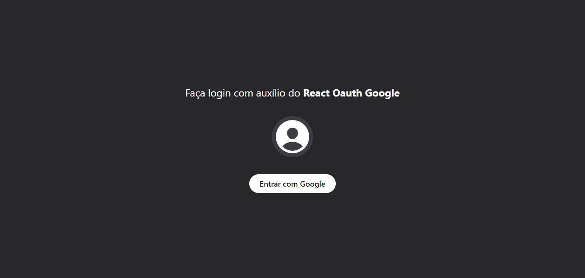

# React Google Authentication

Uma aplicação de página única para autenticação com google.

A página web é de minha autoria e foi inspirada em outras aplicações já existentes, adaptando seus designs e recursos. A aplicação foi desenvolvida utilizando tecnologias como TypeScript, React, TailwindCSS.

## Screenshots



</br>

## Objetivos

O principal objetivo deste projeto foi simular um ambiente que realiza a autenticação do google

Os usuários têm a capacidade de:
- Logar com sua conta do Google

> OBS - Por questões de segurança essa aplicação não está disponível na internet, mas se desejar, você pode fazer um fork do projeto para testes em sua máquina local.

</br>

## Propriedades e Tecnologias

- TypeScript
- React
- TailwindCSS
- React Oauth Google

</br>

## Meu aprendizado

Fazer login com o google é uma ferramenta frequentemente utilizada em diversas aplicações, tras uma simplicidade no processo de autenticação, onde com poucos cliques muita informação é transitada do cliente para o servidor.

<!-- Após estabelecer a conexão com o banco de dados, é necessário criar um esquema para cada objeto:

```tsx
import mongoose from "mongoose";

const HomeSchema = new mongoose.Schema({
    mainText: String,
    description: String,
},
{ timestamps: true });

const Home = mongoose.models.Home || mongoose.model("Home", HomeSchema);

export default Home;
```

Ao definir cada esquema, é necessário criar e exportar o modelo correspondente. Dessa forma, tudo está pronto para ser aplicado em cada rota.

```tsx
import connectToDatabase from "@/database";
import Home from "@/models/Home";
import { NextRequest, NextResponse } from "next/server";

export const dynamic = "force-dynamic";

export async function POST(req: NextRequest) {
    try {
        await connectToDatabase();
        const extractData = await req.json();
        const saveData = await Home.create(extractData);

        if (saveData) {
            return NextResponse.json({
                success: true,
                message: "Data saved successfully",
            });
        } else {
            return NextResponse.json({
                success: false,
                message: "Something goes wrong! Please try again",
            });
        }
    } catch (error) {
        console.log(error);

        return NextResponse.json({
            success: false,
            message: "Something goes wrong! Please try again",
        });
    }
}
```

Veja mais detalhes na documentação oficial [aqui](https://mongoosejs.com/docs/guide.html)
</br> -->

## Autor

- LinkedIn - [Pedro A. Lima](https://www.linkedin.com/in/pedroalima6/)