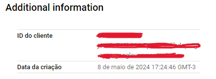

# React Google Authentication

Uma aplicação de página única para autenticação com google.

A página web é de minha autoria e foi inspirada em outras aplicações já existentes, adaptando seus designs e recursos. A aplicação foi desenvolvida utilizando tecnologias como TypeScript, React, TailwindCSS.

## Screenshots


</br>

## Objetivos

O principal objetivo deste projeto foi simular um ambiente que realiza a autenticação do google

Os usuários têm a capacidade de:
- Logar com sua conta do Google

> OBS - Por questões de segurança essa aplicação não está disponível na internet, mas se desejar, você pode fazer um fork do projeto para testes em sua máquina local.

</br>

## Propriedades e Tecnologias

- TypeScript
- React
- TailwindCSS
- React Oauth Google

</br>

## Meu aprendizado

Fazer login com o google é uma ferramenta frequentemente utilizada em diversas aplicações, tras uma simplicidade no processo de autenticação, onde com poucos cliques muita informação é transitada do cliente para o servidor.

Atualmente o pacote disponível para utilizar o serviço é o [react-oauth/google](https://www.npmjs.com/package/@react-oauth/google) com auxilio do [Google Cloud Platform](https://console.cloud.google.com/).

O primeiro precisamos é criar um projeto na plataforma do Google Cloud, você pode conferir o passo a passo nesse [artigo](https://livefiredev.com/in-depth-guide-sign-in-with-google-in-a-react-js-application/). Com isso vamos obter o ID do cliente.



Partindo para o código, precisamos envolver a aplicação com a função GoogleOAuthProvider, utilizando o clientId.

```tsx
...
import { GoogleOAuthProvider } from "@react-oauth/google";

const root = ReactDOM.createRoot(
  document.getElementById("root") as HTMLElement
);
root.render(
  <React.StrictMode>
    <GoogleOAuthProvider clientId="***********-*****************.apps.googleusercontent.com">
      <App />
    </GoogleOAuthProvider>
  </React.StrictMode>
);
```

Isso vai nos dar autorização para utilizar a plataforma do Google Cloud. A partir daqui temos dois caminhos, usar o botão padrão (GoogleLogin) ou o personalizado (useGoogleLogin), nesse artigo seguiremos pelo segundo. 

```tsx
...
import { TokenResponse, useGoogleLogin } from "@react-oauth/google";

function App() {
  const [ user, setUser ] = useState<TokenResponse | undefined>(undefined);

  const login = useGoogleLogin({
    onSuccess: (codeResponse) => {
      console.log("Login successful:", codeResponse);
      setCookie(null, "auth_token", codeResponse.access_token);
      setUser(codeResponse);
    },
    onError: (error) => console.log("Login Failed:", error)
  });

  return (
    <main className="bg-zinc-800 w-full h-screen text-white flex justify-center items-center">
      <div className="flex flex-col items-center gap-10">
        <h3 className="text-2xl">Faça login com auxílio do <strong>React Oauth Google</strong></h3>
        <div className="rounded-full w-[96px] h-[96px] bg-gray-500/30">
            <IoPersonCircle className="w-full h-full" />
        </div>
        <button 
            className="px-6 py-2 bg-white hover:bg-gray-200 transition-all text-black font-semibold text-lg rounded-full" 
            onClick={() => login()}
        >Entrar com Google</button>
      </div>
    </main>
  );
}
...
```

O useGoogleLogin tem duas propriedades por padrão: onSuccess e onError. A primeira é uma função interna que faz uma solicitação para o servidor do Google Cloud e retorna o token de autenticação dentre outras informações, a segunda também é uma função, mas que caputura os erros da solicitação.

Uma obsevação importante a destacar, não é recomendado utilizar esse exemplo em projetos reais, por segurança é necessário utilizar os recursos desse framework em conjunto do back-end, criando uma sessão para guardar as informações, contudo, esse projeto é destinado apenas para fins de estudo prático.


<!--
```tsx
import mongoose from "mongoose";

const HomeSchema = new mongoose.Schema({
    mainText: String,
    description: String,
},
{ timestamps: true });

const Home = mongoose.models.Home || mongoose.model("Home", HomeSchema);

export default Home;
```

Ao definir cada esquema, é necessário criar e exportar o modelo correspondente. Dessa forma, tudo está pronto para ser aplicado em cada rota.

```tsx
import connectToDatabase from "@/database";
import Home from "@/models/Home";
import { NextRequest, NextResponse } from "next/server";

export const dynamic = "force-dynamic";

export async function POST(req: NextRequest) {
    try {
        await connectToDatabase();
        const extractData = await req.json();
        const saveData = await Home.create(extractData);

        if (saveData) {
            return NextResponse.json({
                success: true,
                message: "Data saved successfully",
            });
        } else {
            return NextResponse.json({
                success: false,
                message: "Something goes wrong! Please try again",
            });
        }
    } catch (error) {
        console.log(error);

        return NextResponse.json({
            success: false,
            message: "Something goes wrong! Please try again",
        });
    }
}
```

Veja mais detalhes na documentação oficial [aqui](https://mongoosejs.com/docs/guide.html)
</br> -->

## Autor

- LinkedIn - [Pedro A. Lima](https://www.linkedin.com/in/pedroalima6/)